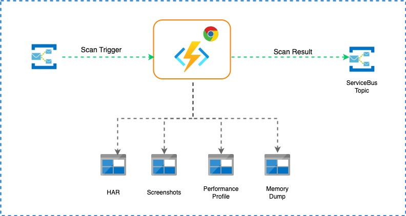

# Synthetic Web Page Scanning
## Overview
This system is designed to automate the synthetic scanning of web pages. It utilizes Azure Functions to trigger Chrome browser scans and produces various outputs such as HAR files, screenshots, performance profiles, and memory dumps. The scan results are then sent to a ServiceBus Topic for further processing.

## Architecture

## Synthetic Scan Process

1. **Triggering the Scan**: The scan can be triggered messages in Service bus topic. 
2. **Executing the Scan**: The Azure Function, utilizing a headless Chrome browser, will navigate to the specified web page and perform the scan.
3. **Generating Artifacts**: During the scan, the function will generate various artifacts:
   - **HAR File**: Captures all network requests and responses.
   - **Screenshots**: Takes screenshots of the web page at different stages.
   - **Performance Profile**: Performance profile json file.
   - **Memory Dump**: Provides a snapshot of the memory used by the browser.
4. **Storing Results**: The results are stored in a azure storae account blob containers.
5. **Publishing to ServiceBus**: The scan results are sent to a ServiceBus Topic for further processing, notifications, or integration with other systems.

### Components

1. **Scan Trigger**: An initial trigger (such as an email) that initiates the scan process.
2. **Azure Function**: The core component that uses a Chrome browser instance to perform the scan.
3. **HAR (HTTP Archive)**: Captures the network waterfall and dependencies data of the scanned web page.
4. **Screenshots**: Takes visual snapshots of the web page during the scan.
5. **Performance Profile**: Records the performance metrics of the web page.
6. **Memory Dump**: Captures the memory usage data of the web page.
7. **ServiceBus Topic**: Receives and handles the scan results for further processing or notifications.
